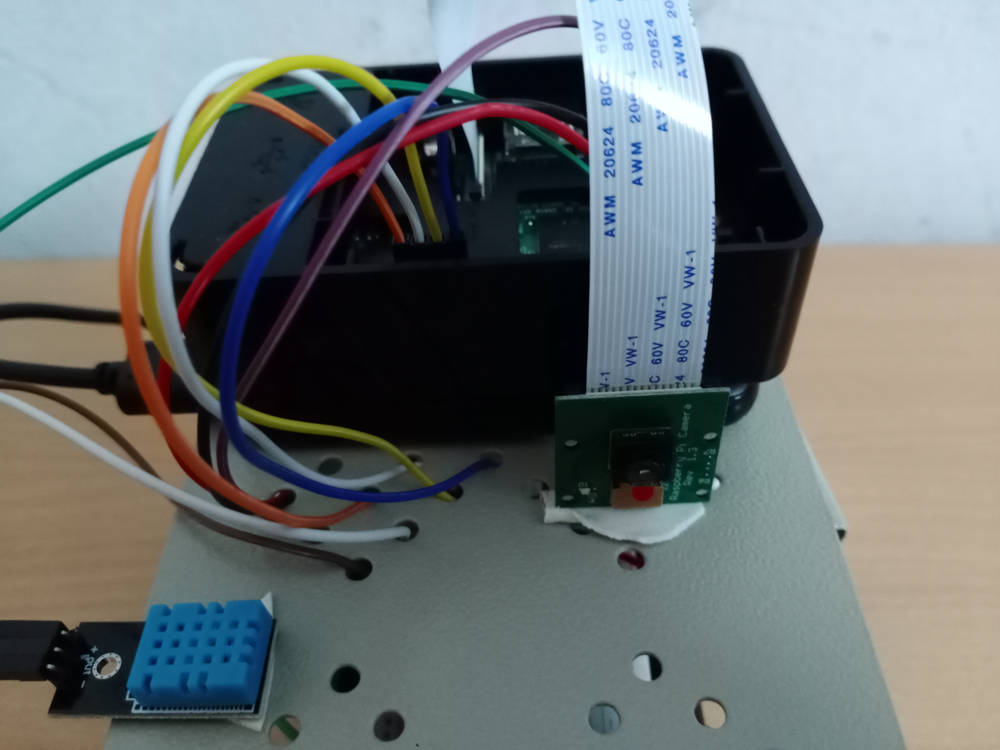
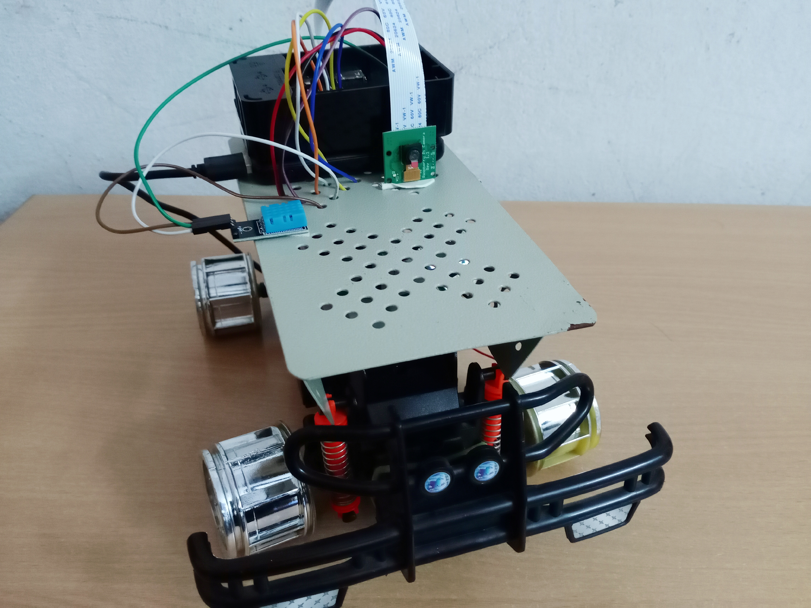

# ARLO-Advanced-Robot-for-Logistics-Patrol-Operations

ARLO is a robot that can be deployed in COVID-19 containment zones for delivery of essential supplies like sanitizers, masks improving safety in logistics and also surveillance of the area.

## PROBLEM IT SOLVES
The main problem we aim to solve is the safety concern in point to point delivery system in pandemics situation like we are facing right now. So, the main objective of our project is to develop a remote prototype that can be used to deliver small payloads of essential supplies in severe effected areas of COVID-19 called containment zones where in-person delivery is restricted. ARLO is capable of carrying and delivering small essential payloads like medical supplies with ease without the need of any contact of personnel (zero contact delivery). 

The idea is that, when there is a need to deliver essential supplies in a containment zone , ARLO can be deployed as a secondary transport for delivery. The primary transport like pickup truck can be used to reach near the delivery zone and from here, ARLO can be used to safely deliver essentials by the operating user to the drop point with the payoad attached to it. From this remote location the user can control ARLO with the help of live stream , streamed from the robot with the help of PiCamera which is mounted on top of it. ARLO can be maneuvered with the help of onscreen controls that control the robot and help the operating user to move the robot to the required location point. Also ARLO is equipped with onboard temperature sensors that relay this temperature data to user, incase of detection of high temprature , gives an alert to follow extreme precaution. This is 
kind of point to point deliver is safe, efficient (since it uses batteries ) and affordable (made with minimal hardware).

Also, the camera feed is used to monitor the containment area which is the patrol module of the robot. The system is equipped with some computer vision applications that are capable of detecting any violation in social distancing and raises an alert. This is possible with the help of feed from the Picamera to the web application which is then used by patrol module.

## CHALLENGES WE RAN INTO
ARLO is a Raspberry Pi based robot which can be wirelessly controlled via WLAN in web app by watching a live stream of where the bot is headed and has onboard multiple onboard sensors-Picamera, DHT temperature sensors etc.  
The first problem we ran into was supplying enough power to both the Raspiberry Pi and motors. We initially powered both of them using battery pack, but it wasn't enough. We solved it by powering the Pi using a Li power bank (1 AMP) and the motors are powered by battery pack which was supplied through H-bridge driver IC.
The next problem we ran into was with the live stream from the Picamera. There is a latency of atleast 4sec which makes the operator impossible to control the robot. We solved this problem by using motion server, which we used to decrease the buffer size and squeeze the maximum performace of the stream. Finally we managed to achieve less than 1 second latency which is feasible. A final trick we applied to access the web app from remote device that is connected to the same WLAN  is to enable port forwarding that helped us to access the web application not only in local environment but also in the external devices that are connected to the Pi's WLAN.

## FEATURES
* Working prototype of robot
* Remotely controlled
* Range can be extended by improving WLAN
* Capable of powering onboard sensors
* Provides Temperature and Humidity readings from onboard sensors
* Can relay data collected from sensors to operating user.
* Updates information whenever the bot moves
* Controlled via web app
* Can relay live feed from pi-camera to the web app
* Capable of delivering small payloads
* Can be used for no contact delivery of essential supplies from remote location

### HARDWARE
HARDWARE:
* Raspberry Pi 3B +
* 2 Brushless Motors
* Chassis
* Dual-H Bridge L293D Motor Drive Control IC
* Temperature Sensor
* Breadboard
* Portable Power Bank

### ALRO

## PATROL SYSTEM

